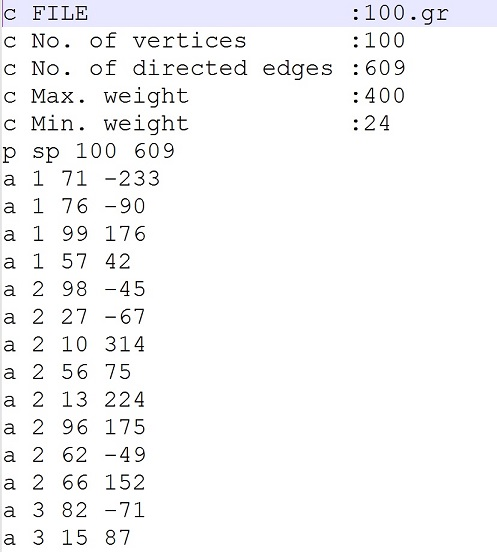

						

# Summary
pyrgg is a random graph generator written in python based on DIMACS formats.
this application get vertices number, max weight, min weight, max edge number(for each vertex), min edge number(for each vertex) and generate graph in flat file format (*.gr).

# References
